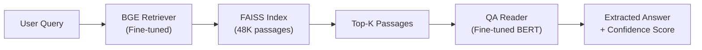

# Add Extractive QA (Reader) Layer — Retriever-Reader Architecture

## Background

The current pipeline is a **retriever-only** system:
```
Query → BGE Encoder → FAISS → Top-K Passages (contexts)
```

We want to add a **QA Reader** layer that extracts the precise answer span from retrieved passages:
```
Query → BGE Retriever → Top-K Passages → QA Reader → Extracted Answer
```

This is the classic **Retriever-Reader** architecture (DPR + BERT QA style).

### Current Retrieval Metrics
| Metric | Score |
|---|---|
| Recall@1 | 0.5636 |
| Recall@5 | 0.8176 |
| MRR | 0.6680 |
| F1 (passage-level) | 0.6100 |

### Why This Helps
- The retriever finds relevant passages, but returns entire chunks (~240 words)
- The QA reader will pinpoint the **exact answer span** (typically 1-15 words)
- End-to-end: user asks a question → gets a concise, precise answer + source passage

## Architecture Overview



## Proposed Changes

### Step 0: Download Base QA Model

We need `bert-base-uncased` as the base model for fine-tuning the QA reader. This needs to be downloaded to `hf_cache/` since the system is offline.

> [!IMPORTANT]
> **You'll need internet access once** to download `bert-base-uncased` (~440MB) to `hf_cache/`. After that, everything runs offline. If you prefer a different base model (e.g., `distilbert-base-uncased` for faster inference, or `roberta-base` for potentially better accuracy), let me know.

#### [NEW] [download_qa_model.py](file:///home/administrator/Desktop/Kartik/Kartik/SemiSagev2.0%20(2)/SemiSagev2.0/download_qa_model.py)

One-time script to download `bert-base-uncased` to `hf_cache/`:
```python
from huggingface_hub import snapshot_download
snapshot_download(
    repo_id="bert-base-uncased",
    cache_dir="hf_cache"
)
```

---

### Step 1: Prepare QA Training Data

#### [NEW] [09_prepare_qa_data.py](file:///home/administrator/Desktop/Kartik/Kartik/SemiSagev2.0%20(2)/SemiSagev2.0/09_prepare_qa_data.py)

Convert `cleaned_dataset.json` to HuggingFace QA format (SQuAD-style):

- **Input**: `cleaned_dataset.json` (49,603 records with `question`, `context`, `answer`, `answer_start`)
- **Output**: `qa_train.json`, `qa_val.json`, `qa_test.json`
- **Format**: Each record contains `id`, `question`, `context`, `answers: {text: [...], answer_start: [...]}`
- **Split**: 80/10/10 train/val/test
- **Validation**: Verify `answer_start` is correct — re-find the answer span in context if needed
- **Context windowing**: Use the full context (not the ±100 char window used for retrieval) since the QA model needs enough surrounding text to understand the passage

---

### Step 2: Train the QA Model

#### [NEW] [10_train_qa.py](file:///home/administrator/Desktop/Kartik/Kartik/SemiSagev2.0%20(2)/SemiSagev2.0/10_train_qa.py)

Fine-tune `bert-base-uncased` for extractive QA on the domain data:

**Training configuration (optimized for RTX A2000 12GB):**

| Parameter | Value | Rationale |
|---|---|---|
| Base model | `bert-base-uncased` | 110M params, fits in 12GB with batch 16 |
| Max seq length | 384 | Standard for QA, covers ~240-word contexts |
| Doc stride | 128 | Sliding window overlap for long contexts |
| Batch size | 16 | Safe for 12GB VRAM with AMP |
| Learning rate | 3e-5 | Standard for BERT QA fine-tuning |
| Epochs | 3 | Standard for SQuAD-style training |
| Warmup ratio | 0.1 | 10% of training steps |
| FP16/AMP | Yes | Saves VRAM, speeds up training |
| Weight decay | 0.01 | Regularization |

**Key implementation details:**
- Uses HuggingFace `Trainer` + `AutoModelForQuestionAnswering`
- Tokenizes with sliding window (`doc_stride=128`) for contexts that exceed `max_length`
- Handles offset mapping to convert token positions back to character positions
- Saves best model based on validation F1
- Saves to `qa_model_finetuned/` directory

---

### Step 3: Evaluate the QA Model (Standalone)

#### [NEW] [11_evaluate_qa.py](file:///home/administrator/Desktop/Kartik/Kartik/SemiSagev2.0%20(2)/SemiSagev2.0/11_evaluate_qa.py)

Evaluate the QA reader in isolation (given the correct context):

**Metrics:**
- **Exact Match (EM)**: Does the predicted answer exactly match the ground truth?
- **F1 Score**: Token-level overlap between predicted and ground truth answers
- **Answer confidence**: Average confidence score of predictions

This evaluates the reader quality independently of the retriever.

---

### Step 4: Create Combined Retriever-Reader Pipeline

#### [NEW] [12_pipeline.py](file:///home/administrator/Desktop/Kartik/Kartik/SemiSagev2.0%20(2)/SemiSagev2.0/12_pipeline.py)

End-to-end pipeline combining retrieval + QA:

```python
def answer_question(query, top_k=3):
    # Step 1: Retrieve top-K passages using BGE + FAISS
    passages = retrieve(query, top_k)
    
    # Step 2: Run QA model on each retrieved passage
    answers = []
    for passage in passages:
        answer, score, start, end = extract_answer(query, passage)
        answers.append({
            "answer": answer,
            "score": score,
            "context": passage,
            "start": start,
            "end": end
        })
    
    # Step 3: Rank answers by confidence score
    answers.sort(key=lambda x: x["score"], reverse=True)
    return answers
```

Features:
- Interactive CLI mode for testing
- Returns answer + confidence score + source passage
- Ranks answers from multiple passages by QA confidence
- Can be imported as a module in other scripts

---

### Step 5: Evaluate Full Pipeline (End-to-End)

#### [NEW] [13_evaluate_pipeline.py](file:///home/administrator/Desktop/Kartik/Kartik/SemiSagev2.0%20(2)/SemiSagev2.0/13_evaluate_pipeline.py)

End-to-end evaluation: query → retrieval → QA → answer:

**Metrics:**
- **Retrieval Recall@K**: Does the correct passage appear in top-K? (already have this)
- **End-to-end EM**: Is the final extracted answer an exact match?
- **End-to-end F1**: Token-level F1 of the final answer
- **Answer confidence**: How confident is the QA model?

---

### Step 6: Update Search Script

#### [MODIFY] [06_search.py](file:///home/administrator/Desktop/Kartik/Kartik/SemiSagev2.0%20(2)/SemiSagev2.0/06_search.py)

Update to optionally use the QA reader after retrieval, so it returns extracted answers alongside passages.

## Open Questions

> [!IMPORTANT]
> **Base model choice**: I'm proposing `bert-base-uncased` (110M params). Alternatives:
> - `distilbert-base-uncased` — 66M params, ~2x faster inference, slightly lower accuracy
> - `roberta-base` — 125M params, often better than BERT on QA tasks
> - `deepset/minilm-uncased-squad2` — 33M params, pre-trained on SQuAD, fastest option
> 
> Which do you prefer? Or should I go with `bert-base-uncased`?

> [!NOTE]
> **Internet access needed**: You'll need to be online once to download the base QA model (~440MB for bert-base). After that, everything runs offline from `hf_cache/`.

## Verification Plan

### Automated Tests
1. Run `09_prepare_qa_data.py` — verify train/val/test JSON files are valid
2. Run `10_train_qa.py` — train and verify model saves correctly
3. Run `11_evaluate_qa.py` — get standalone QA metrics (EM, F1)
4. Run `13_evaluate_pipeline.py` — get end-to-end metrics
5. Test `12_pipeline.py` with sample queries interactively

### Expected Metrics (rough targets)
| Metric | Target |
|---|---|
| QA EM (standalone, correct context) | ~60-70% |
| QA F1 (standalone, correct context) | ~75-85% |
| End-to-end EM (retrieval + QA) | ~40-50% |
| End-to-end F1 (retrieval + QA) | ~50-60% |
