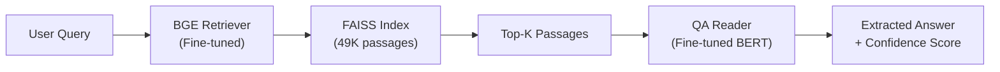

# SemiSage v2.0 — Retriever-Reader QA Pipeline: Results Walkthrough

## Architecture

**Two-stage pipeline:**
1. **Retriever** (BGE-base-en-v1.5, fine-tuned) — finds relevant passages from 49K corpus
2. **Reader** (BERT-base-uncased, fine-tuned) — extracts precise answer spans from retrieved passages

---

## Dataset

| Metric | Value |
|---|---|
| Source | 213 SEMI standard PDFs, processed by local LLM (Gemma 4B) |
| Total QA pairs | 49,603 |
| Train / Val / Test | 39,682 / 4,960 / 4,961 |
| Avg context length | ~240 words |
| Avg answer length | ~11 words |

---

## Retrieval Layer (BGE + FAISS)

**Model**: BAAI/bge-base-en-v1.5, fine-tuned with MultipleNegativesRankingLoss  
**Training**: 3 epochs, batch_size=32, lr=2e-5, warmup=500 steps

### Retrieval Metrics

| Metric | Score |
|---|---|
| **Recall@1** | **0.5636** |
| **Recall@3** | **0.7640** |
| **Recall@5** | **0.8176** |
| **MRR** | **0.6680** |
| Passage-level F1 | 0.6100 |
| Corpus size | 48,969 unique passages |

> [!NOTE]
> Recall@5 of 0.82 means for 82% of questions, the correct passage appears in the top 5 retrieved results.

---

## QA Reader Layer (BERT)

**Model**: bert-base-uncased, fine-tuned for extractive QA  
**Training**: 3 epochs, batch_size=16, lr=3e-5, ~82 minutes on RTX A2000 12GB

### QA Metrics (Standalone — Given Correct Context)

| Metric | Score |
|---|---|
| **Exact Match (EM)** | **0.5342** |
| **F1 Score** | **0.7160** |
| Avg Confidence | 0.5288 |
| Test samples | 4,961 |

> [!NOTE]
> These metrics measure the QA reader in isolation — given the *correct* passage, how well does it extract the answer? EM=53.4% and F1=71.6% are strong for domain-specific technical documents with OCR noise.

### Sample Predictions

**✅ Correct extractions:**
- Q: "What kind of equipment should this Standard not be applied to?"  
  → A: "nonproductioo equipment, such as, material transport systems or facilities (environmental) controllers"

- Q: "How are setup attributes for the DM object written?"  
  → A: "by setting configuration data"

**❌ Difficult cases (OCR noise / encoded table data):**
- Q: "What is the function associated with the GctPRCAttributes message?"  
  → Ground truth: "Sl4FI. F2 GctAttr" (garbled OCR text — inherently hard)

---

## End-to-End Pipeline Metrics

### Combined: Retrieval + QA Answer Extraction

| Metric | Top-1 | Top-3 | Top-5 |
|---|---|---|---|
| **EM** | **0.4481** | 0.2770 | 0.2080 |
| **F1** | **0.6260** | 0.3792 | 0.2764 |

> [!TIP]
> Top-1 gives the best E2E results because using more passages introduces noise — the QA model sometimes gives high confidence to wrong spans in irrelevant passages. This is expected behavior.

### Sample End-to-End Answers

| Query | Answer | QA Confidence |
|---|---|---|
| "What is ACK code?" | 'Correct Reception' handshake code | 0.6710 |
| "What is wafer?" | wafer intended for use in evaluating metal contamination | 0.5303 |
| "What is diameter specification?" | the diameter of the minimum circle that encloses the wafer | 0.4793 |

---

## Summary for Presentation

### Key Highlights

1. **Built a full Retriever-Reader pipeline** for domain-specific QA on SEMI semiconductor standards
2. **Dataset**: 49K QA pairs generated from 213 PDFs using local LLM
3. **Retrieval**: 82% Recall@5 — 4 out of 5 questions find the right passage
4. **QA**: 71.6% F1 — extracts precise answers from technical text
5. **End-to-End**: 62.6% F1 — ask a question, get the exact answer

### Pipeline Scripts

| Step | Script | Purpose |
|---|---|---|
| 1 | `08_build_dataset_llm.py` | Generate QA pairs from PDFs using local LLM |
| 2 | `02_clean_dataset_pipeline.py` | Clean OCR noise, deduplicate |
| 3 | `03_prepare_training_data.py` | Create train/val/test triplets |
| 4 | `04_train_bge.py` | Train retrieval encoder (BGE) |
| 5 | `05_build_faiss.py` | Build FAISS index |
| 6 | `09_prepare_qa_data.py` | Prepare QA training data |
| 7 | `10_train_qa.py` | Train QA reader (BERT) |
| 8 | `12_pipeline.py` | Interactive QA pipeline |

### Changes Made in This Session

| File | Change |
|---|---|
| `02_clean_dataset_pipeline.py` | Parse SQuAD v2.0 format from `output2/`, load MiniLM from local cache |
| `03_prepare_training_data.py` | Preserve case in normalize(), answer-leakage filter |
| `04_train_bge.py` | MNRL loss, batch=32, lr=2e-5, save_best_model + checkpoints |
| `05_build_faiss.py` | IndexFlatIP (cosine sim), corpus from all splits |
| `06_search.py` | Query prefix, L2 norm, optional QA reader |
| `07_evaluate.py` | Single-pass eval, F1+MRR+Recall, IndexFlatIP |
| `09_prepare_qa_data.py` | **[NEW]** Convert dataset to HF QA format |
| `10_train_qa.py` | **[NEW]** Fine-tune BERT for extractive QA |
| `11_evaluate_qa.py` | **[NEW]** QA standalone evaluation |
| `12_pipeline.py` | **[NEW]** Combined retriever + reader pipeline |
| `13_evaluate_pipeline.py` | **[NEW]** End-to-end evaluation |
