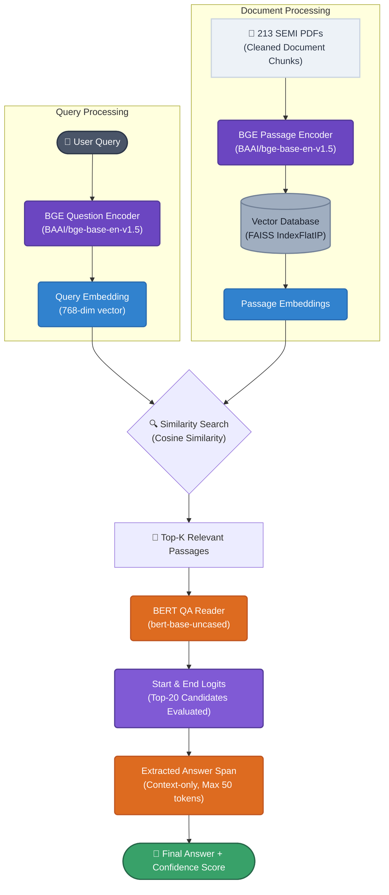

```mermaid
flowchart TD
    %% Define styles mimicking the original image
    classDef user fill:#4a5568,color:#fff,stroke:#2d3748,stroke-width:2px,rx:10px
    classDef encoder fill:#6b46c1,color:#fff,stroke:#553c9a,stroke-width:2px,rx:5px
    classDef embedding fill:#3182ce,color:#fff,stroke:#2b6cb0,stroke-width:2px,rx:5px
    classDef db fill:#a0aec0,color:#1a202c,stroke:#718096,stroke-width:2px,shape:cylinder
    classDef reader fill:#dd6b20,color:#fff,stroke:#c05621,stroke-width:2px,rx:5px
    classDef logits fill:#805ad5,color:#fff,stroke:#553c9a,stroke-width:2px,rx:5px
    classDef result fill:#38a169,color:#fff,stroke:#276749,stroke-width:2px,rx:5px
    classDef docs fill:#edf2f7,color:#2d3748,stroke:#cbd5e0,stroke-width:2px

    %% Subgraphs to organize layout
    subgraph Query Processing
        direction TB
        Q(["👤 User Query"]) --> QE["BGE Question Encoder<br/>(BAAI/bge-base-en-v1.5)"]
        QE --> QEmb["Query Embedding<br/>(768-dim vector)"]
    end

    subgraph Document Processing
        direction TB
        Docs["📄 213 SEMI PDFs<br/>(Cleaned Document Chunks)"] --> PE["BGE Passage Encoder<br/>(BAAI/bge-base-en-v1.5)"]
        PE --> DB[("Vector Database<br/>(FAISS IndexFlatIP)")]
        DB --> PEmb["Passage Embeddings"]
    end

    %% Similarity Search Phase
    QEmb --> SS{"🔍 Similarity Search<br/>(Cosine Similarity)"}
    PEmb --> SS
    SS --> TopK["📑 Top-K Relevant Passages"]

    %% QA Reader Phase
    TopK --> RE["BERT QA Reader<br/>(bert-base-uncased)"]
    RE --> Logits["Start & End Logits<br/>(Top-20 Candidates Evaluated)"]
    Logits --> Span["Extracted Answer Span<br/>(Context-only, Max 50 tokens)"]
    Span --> Final(["📌 Final Answer + Confidence Score"])

    %% Apply Classes
    class Q user
    class QE,PE encoder
    class QEmb,PEmb embedding
    class DB db
    class RE reader
    class Logits logits
    class Span reader
    class Final result
    class Docs docs
```