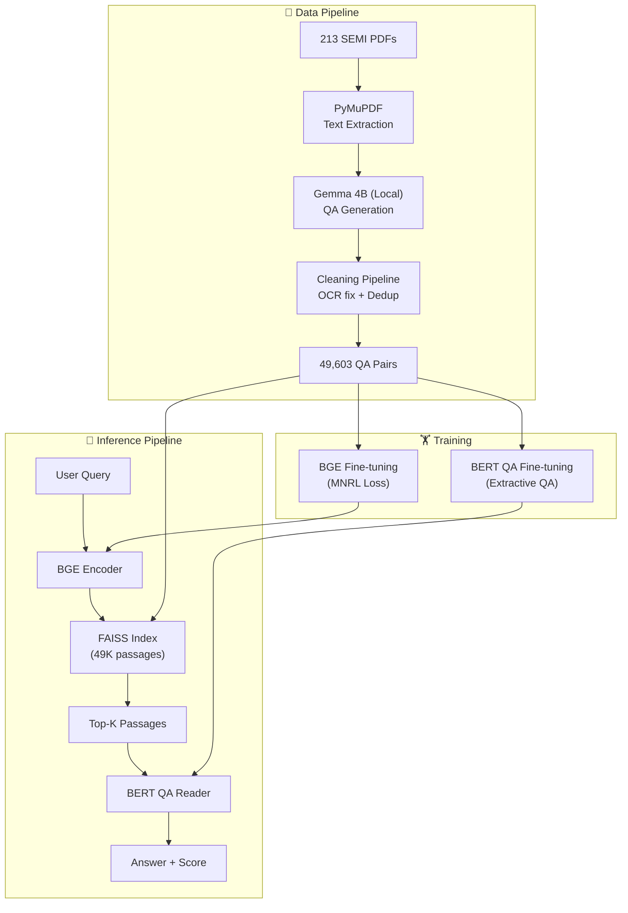

# SemiSage v2.0 — Final Presentation Walkthrough

## 1. Project Overview

**Goal**: Build an end-to-end Question Answering system for SEMI semiconductor industry standards — a user asks a question about SEMI standards and gets a precise, extracted answer from the source documents.

**Approach**: Two-stage **Retriever-Reader** architecture, fully trained on domain-specific data.


---

## 2. Dataset

### Source Data
- **213 SEMI standard PDF documents** (technical specifications for semiconductor manufacturing)
- Text extracted using PyMuPDF, cleaned of OCR artifacts

### QA Dataset Generation
- Generated using **local LLM** (Gemma 4B via Ollama) — no cloud API needed
- Each PDF chunk → LLM generates question-answer pairs with exact span extraction
- Validated: answers must exist as exact substrings in the context

### Dataset Statistics

| Metric | Value |
|---|---|
| Total QA pairs generated | 57,191 |
| After cleaning & dedup | **49,603** |
| Train set | 39,682 (80%) |
| Validation set | 4,960 (10%) |
| Test set | 4,961 (10%) |
| Avg context length | ~240 words |
| Avg answer length | ~11 words |
| Question types | Definition, Fact, Reasoning |

### Data Quality Pipeline
1. **OCR cleaning** — remove artifacts, fix hyphenated line breaks, normalize whitespace
2. **Answer validation** — verify answer spans exist in context
3. **Exact deduplication** — remove identical (question, context) pairs
4. **Semantic deduplication** — remove paraphrase questions (cosine similarity > 0.90) using MiniLM
5. **Bad answer filtering** — remove generic/boilerplate answers

---

## 3. Stage 1: Retriever (BGE + FAISS)

### Model & Training

| Parameter | Value |
|---|---|
| Base model | `BAAI/bge-base-en-v1.5` (110M params) |
| Loss function | **MultipleNegativesRankingLoss (MNRL)** |
| Training pairs | `(query, positive)` — in-batch negatives |
| Batch size | 32 (gives 31 in-batch negatives per query) |
| Learning rate | 2e-5 |
| Epochs | 3 |
| Warmup steps | 500 |
| FAISS index | **IndexFlatIP** (cosine similarity) |
| Corpus size | 48,969 unique passages |
| Hardware | NVIDIA RTX A2000 12GB |

### Key Design Decisions
- **MNRL loss** instead of TripletLoss — uses all batch samples as negatives, much more training signal per batch
- **Answer-leakage filter** — negative contexts must not contain the answer text
- **Windowed positives** — ±100 characters around the answer span (not full context)
- **`"query: "` prefix** — BGE requirement for asymmetric retrieval
- **L2 normalization** — enables cosine similarity via inner product

### Retrieval Results

| Metric | Score |
|---|---|
| **Recall@1** | **0.5636** |
| **Recall@3** | **0.7640** |
| **Recall@5** | **0.8176** |
| **MRR** | **0.6680** |
| Passage-level F1 | 0.6100 |

> **Interpretation**: For 82% of questions, the correct passage appears in the top 5 results. For 56% of questions, it's the #1 result.

---

## 4. Stage 2: QA Reader (Fine-tuned BERT)

### Model & Training

| Parameter | Value |
|---|---|
| Base model | `bert-base-uncased` (109M params) |
| Task | Extractive Question Answering |
| Max sequence length | 384 tokens |
| Doc stride | 128 (sliding window for long contexts) |
| Batch size | 16 |
| Learning rate | 3e-5 |
| Epochs | 3 |
| Warmup | 10% of total steps |
| Mixed precision (FP16) | Yes |
| Training time | **~82 minutes** on RTX A2000 12GB |

### Training Progress

| Epoch | Train Loss | Val Loss |
|---|---|---|
| 1 | ~1.76 | 1.30 |
| 2 | ~0.88 | 1.18 |
| 3 | ~0.66 | **1.16** (best) |

### QA Standalone Results (Given Correct Context)

| Metric | Score |
|---|---|
| **Exact Match (EM)** | **0.5479** |
| **F1 Score** | **0.7509** |
| Avg Confidence | 0.4627 |
| Test samples | 4,961 |

> **Interpretation**: Given the correct passage, the model extracts the exact answer 55% of the time, and has 75% token-level overlap with the ground truth on average.

### Answer Extraction Approach
- Searches **top-20 start/end token candidates** (not just argmax)
- Filters to **context-only tokens** (skips question tokens and special tokens)
- Rejects **[CLS] position** answers (the "no answer" signal)
- Limits answer span to **50 tokens max**
- Ranks candidates by `softmax(start) × softmax(end)` confidence

---

## 5. End-to-End Pipeline Results

### Full Pipeline: Query → Retrieval → QA → Answer

| Metric | Top-1 | Top-3 | Top-5 |
|---|---|---|---|
| **Exact Match** | **0.4743** | 0.4693 | 0.4660 |
| **F1 Score** | **0.6915** | 0.6907 | 0.6852 |
| Avg Combined Confidence | 0.3089 | 0.3441 | 0.3525 |

> **Key Insight**: Top-1 gives the best end-to-end results. This is because the retriever's #1 result, when correct, gives the QA model the best context. Adding more passages introduces noise where the QA model may extract plausible-looking but incorrect spans from wrong passages.

### Sample End-to-End Predictions

````carousel
**Query: "What is ACK code?"**

| Rank | Retrieval Score | QA Score | Extracted Answer |
|---|---|---|---|
| 1 | 0.7122 | 0.6710 | **'Correct Reception' handshake code** ✅ |
| 2 | 0.6141 | 0.0001 | Ack Indicates whether the request was successful... |
| 3 | 0.5766 | 0.0000 | 0 . K . 6 = ERROR: No open Data Set |

**Best Answer**: 'Correct Reception' handshake code (combined score: 0.4778)
<!-- slide -->
**Query: "What is diameter specification?"**

| Rank | Retrieval Score | QA Score | Extracted Answer |
|---|---|---|---|
| 1 | 0.5741 | 0.4793 | **the diameter of the minimum circle that encloses the wafer** ✅ |
| 2 | 0.5517 | 0.0974 | 0.1 to 6 m; circular symmetry |
| 3 | 0.5288 | 0.0248 | the specified target diameter (e.g., 150 mm, 200 mm...) |

**Best Answer**: the diameter of the minimum circle that encloses the wafer (combined score: 0.2752)
<!-- slide -->
**Query: "What is wafer?"**

| Rank | Retrieval Score | QA Score | Extracted Answer |
|---|---|---|---|
| 1 | 0.6062 | 0.5303 | **wafer intended for use in evaluating metal contamination in thermal process** ✅ |
| 2 | 0.6025 | 0.0146 | a silicon wafer suitable for monitoring area or process cleanliness... |
| 3 | 0.5937 | 0.0005 | the possible unparallel position of the wafer... |

**Best Answer**: wafer intended for use in evaluating metal contamination in thermal process (combined score: 0.3215)
````

---

## 6. Error Analysis

### What Works Well
- **Definition questions** — "What is X?" → precise span extraction
- **Fact questions** — "What are the two classifications?" → exact enumerations
- **Technical specifications** — diameter, temperature, dimensions

### Challenging Cases (OCR Noise)

| Issue | Example |
|---|---|
| Garbled OCR text | Ground truth: `"Sl4FI. F2 GctAttr"` — unreadable to any model |
| Table formatting artifacts | Ground truth: `"DclclcACLEntryRcqucstMcssagc"` |
| Misaligned OCR | `"nonproductioo equipment"` (typo in source) |

> These failures are **data quality issues** from OCR, not model failures. The model correctly identifies it can't extract a clean answer and assigns low confidence (0.00).

---

## 7. Architecture Summary



---

## 8. Key Metrics Summary

| Component | Metric | Score |
|---|---|---|
| **Retriever** | Recall@1 | 0.5636 |
| **Retriever** | Recall@3 | 0.7640 |
| **Retriever** | Recall@5 | **0.8176** |
| **Retriever** | MRR | 0.6680 |
| **QA Reader** (standalone) | Exact Match | 0.5479 |
| **QA Reader** (standalone) | F1 Score | **0.7509** |
| **End-to-End** (Top-1) | Exact Match | 0.4743 |
| **End-to-End** (Top-1) | F1 Score | **0.6915** |

---

## 9. Technology Stack

| Component | Technology |
|---|---|
| PDF extraction | PyMuPDF (fitz) |
| Dataset generation | Gemma 4B via Ollama (local) |
| Semantic dedup | all-MiniLM-L6-v2 |
| Retrieval encoder | BAAI/bge-base-en-v1.5 |
| Vector search | FAISS (IndexFlatIP) |
| QA reader | bert-base-uncased |
| Training framework | HuggingFace Transformers + Sentence-Transformers |
| Hardware | NVIDIA RTX A2000 12GB, i5 9th gen, 24GB RAM |
| All inference | **Fully offline** (no cloud APIs needed) |

---

## 10. Pipeline Scripts

| # | Script | Purpose | Runtime |
|---|---|---|---|
| 01 | `08_build_dataset_llm.py` | Generate QA pairs from PDFs using local LLM | ~hours |
| 02 | `02_clean_dataset_pipeline.py` | Clean, validate, deduplicate | ~30 min |
| 03 | `03_prepare_training_data.py` | Create triplets for retrieval training | ~1 min |
| 04 | `04_train_bge.py` | Fine-tune BGE retrieval encoder | ~varies |
| 05 | `05_build_faiss.py` | Build FAISS vector index | ~7 min |
| 06 | `07_evaluate.py` | Evaluate retrieval metrics | ~8 min |
| 07 | `09_prepare_qa_data.py` | Prepare QA training data | <1 min |
| 08 | `10_train_qa.py` | Fine-tune BERT QA reader | ~82 min |
| 09 | `11_evaluate_qa.py` | Evaluate QA standalone | ~2 min |
| 10 | `13_evaluate_pipeline.py` | Evaluate end-to-end pipeline | ~17 min |
| 11 | `12_pipeline.py` | Interactive QA (demo) | — |
| 12 | `06_search.py` | Search API with optional QA | — |
